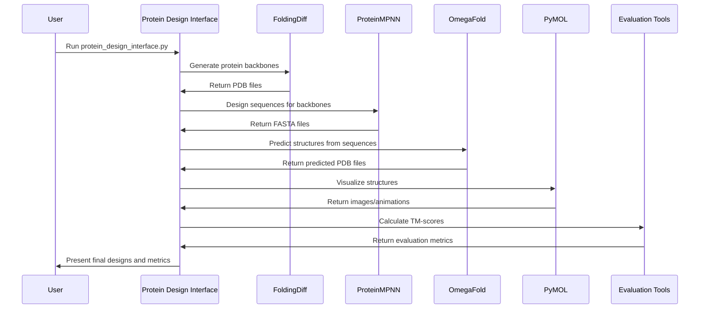

```mermaid
sequenceDiagram
    participant User
    participant Interface as Protein Design Interface
    participant FD as FoldingDiff
    participant MPNN as ProteinMPNN
    participant OF as OmegaFold
    participant PyMOL
    participant Eval as Evaluation Tools

    User->>Interface: Run protein_design_interface.py
    
    Interface->>FD: Generate protein backbones
    FD->>Interface: Return PDB files
    
    Interface->>MPNN: Design sequences for backbones
    MPNN->>Interface: Return FASTA files
    
    Interface->>OF: Predict structures from sequences
    OF->>Interface: Return predicted PDB files
    
    Interface->>PyMOL: Visualize structures
    PyMOL->>Interface: Return images/animations
    
    Interface->>Eval: Calculate TM-scores
    Eval->>Interface: Return evaluation metrics
    
    Interface->>User: Present final designs and metrics
```
