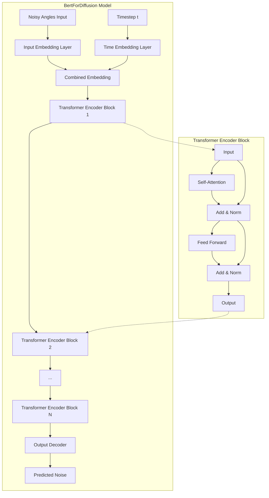

```mermaid
graph TD
    subgraph "BertForDiffusion Model"
        A1[Noisy Angles Input] --> A2[Input Embedding Layer]
        A2 --> A5[Combined Embedding]
        
        B1[Timestep t] --> B2[Time Embedding Layer]
        B2 --> A5
        
        A5 --> C1[Transformer Encoder Block 1]
        C1 --> C2[Transformer Encoder Block 2]
        C2 --> C3[...]
        C3 --> C4[Transformer Encoder Block N]
        
        C4 --> D1[Output Decoder]
        D1 --> D2[Predicted Noise]
    end
    
    subgraph "Transformer Encoder Block"
        E1[Input] --> E2[Self-Attention]
        E2 --> E3[Add & Norm]
        E1 --> E3
        E3 --> E4[Feed Forward]
        E4 --> E5[Add & Norm]
        E3 --> E5
        E5 --> E6[Output]
    end
    
    C1 -.-> E1
    E6 -.-> C2
```
